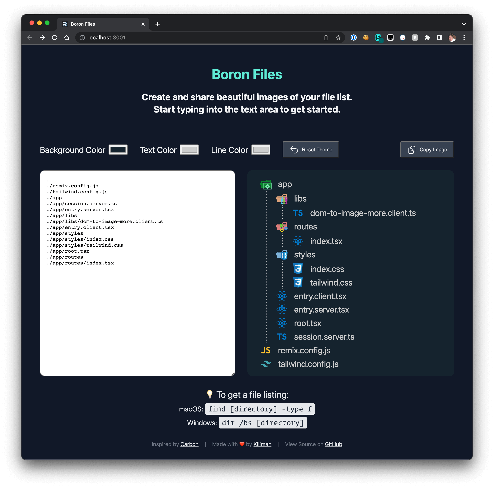

# Boron Files

This app is inspired by the [Carbon](https://carbon.now.sh/) source-code image generator. It enables you to create and share beautiful images of your file list. It uses the [`vscode-icons`](https://github.com/microsoft/vscode-icons) package for the file and folder icons.

Check it out at https://boron-files.railway.app

